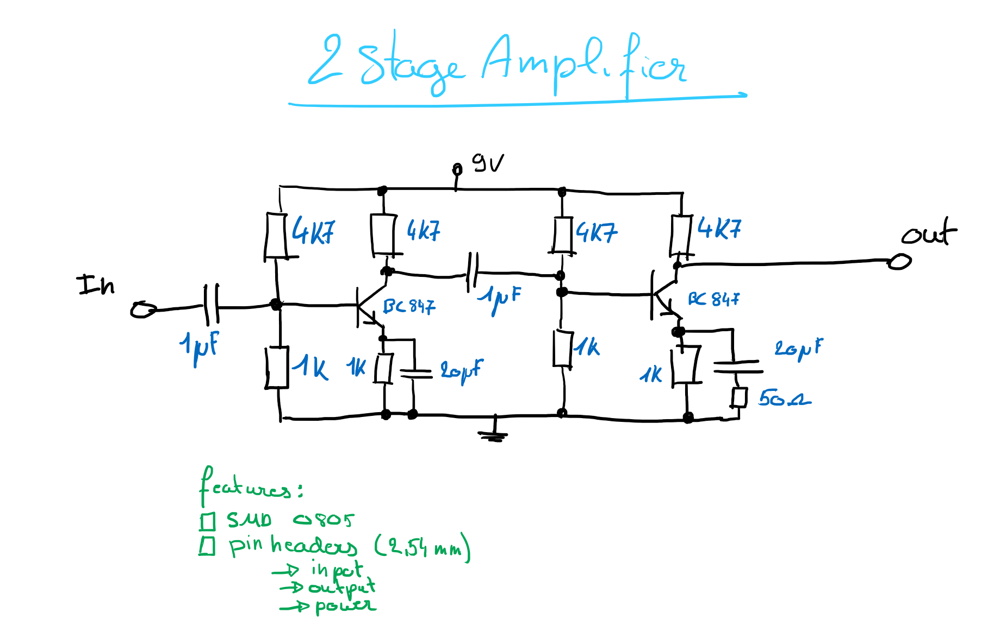

# 2 Stage Amplifier

2 Stage Amplifier using BC847 transistors. All components should be SMD, except for pinheaders and connectors.

Name: <!-- TODO: place nam here -->

## Schematic

 <!-- TODO: Remove draft image when done -->

<!-- TODO: place image here -->

## PCB

| Front | Back |
|---|---|
| <!-- TODO: place image here --> | <!-- TODO: place image here --> |

## BOM

The BOM or Bill of Materials consists out of a list of all the components with some of theire properties. 

| Designator | Quantity | Description | Footprint | Farnell ordercode | Price |
|---|---|---|---|---|---|
| C1, C4 | 2 | 100nF | 0805 | [123456](https://be.farnell.com/raspberry-pi/rpi4-modbp-4gb/raspberry-pi-4-model-b-4gb/dp/3051887?ICID=I-HP-PP-RASPBERRY-PI-SEP_20-WF2293904) | 0.0012 € | <!-- TODO: remove this example -->
|||||||
|||||||

Total price: <!-- TODO: calculate total price -->
